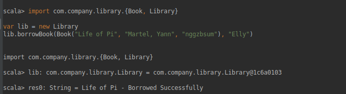
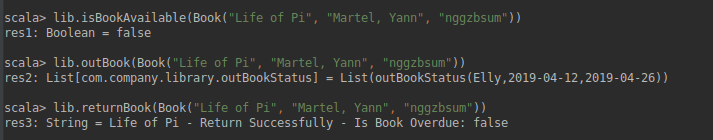

# Gone With The Wind
Gone With The Wind is a Scala console application that aims to keep track of general library operations. This project follows the instructions and requirements from [here](https://github.com/EllyChanx/GoneWithTheWind/blob/master/Instruction.md).

## Usage
* Clone the project
* Import via IntelliJ IDEA
* Run Scala Console

#### Demonstration on Borrow/Return:  
Import `Book` and `Library`, then use `.borrowBook` with Book item and borrower in string:  


To check book availability, use `.isBookAvailable`  
To check borrowed book info., use `.outBook`  
To return book, use `.returnBook` with Book item  
  

## Approach 

### Availability and "Out Book" Status  
Books' availability are mapped into an `.isBookAvailable` hashmap with format:  
```
Map[book: Book -> Availability: Boolean = true]
```  
  
All the borrowed books are mapped into an `.outBook` map with format:  
```
Map[book: Book -> List[outBookStatus(borrower, borrowDate, dueDate)]]
```

### Map for Data Structure
The methods for books searching were originally performed using `.filter` to a `List`:  
```
  def findBookByTitle(title: String): List[Book] = {
    Books.all.filter(_.title.contains(title))
  }
```
They were later updated to a more scalable approach using `Map` for [faster search runtime](https://adrianmejia.com/blog/2018/04/28/data-structures-time-complexity-for-beginners-arrays-hashmaps-linked-lists-stacks-queues-tutorial/) and to process larger data input in future (potentially). 
```
  val titleMap:immutable.Map[String, List[Book]] = Books.all.groupBy(book => book.title)

  def findBookByTitle(title: String):List[Book] = {
    this.titleMap.filter(
      p => p._1.containsSlice(title)
    ).values.flatten.toList
  }
```

## Improvement and Contribution

### Borrow History
Currently, books' borrow histories are not stored because the returning book will remove the record entirely from the `.outBook` map.  This can be implemented by adding a return status to the `.outBook` map:
```
Map[book: Book -> List[outBookStatus(borrower, borrowDate, dueDate, returnStatus)]]  
```
When user returns a book, update `returnStatus` instead of removing it completely. After updating `.addOutBook` and `.findLateOutBook`'s verification, the `.outBook` map will be able to store borrow history for all the books.

### Fine Calculation
Fine for overdue book is not calculated since the rate is not specified. After the rate is confirmed, this can be implemented by using `.getDays` to get number of days between `dueDate` and `LocalDate.now` times the fine rate.
